# 📊 MarketMind Pro — Tomorrow's Complete Step-by-Step Operational Master Guide

> **Document Type:** Operational Execution Blueprint & System Telemetry Timeline  
> **Target Date:** Tomorrow's Trading Session  
> **Bot Engine:** `main.py` (Autonomous Intraday Scanner & Multi-Period High-Return Engine)  
> **AI Brain:** Groq DeepSeek `compound-mini` (Supervisory Risk & Pick Validation Layer)  
> **Universe Mode:** Strictly Small & Midcap (2,489 stocks, large-caps excluded)  
> **Web Dashboard:** `http://localhost:5001` (Live Process Control & Market Pulse)  

---

## ⏰ Chronological Trading Day Execution Timeline

```mermaid
gantt
    title Intraday Screener Full Single-Day Execution Lifecycle
    dateFormat  HH:mm
    axisFormat  %H:%M
    section Pre-Market
    System Health & DB Init       :08:30, 30m
    Universe Filter & News Cache  :09:00, 15m
    section Trading Session
    Period 1 - Morning ORB (+5.5% to +8.0%)  :09:15, 60m
    Period 2 - VWAP Pullback (+5.0% to +6.5%):10:15, 135m
    Period 3 - Afternoon Surge (+5.0% to +7.5%):12:30, 105m
    section Closing & EOD
    Square-Off & Profit Lock      :14:15, 75m
    Official Close & EOD Telemetry:15:30, 30m
```

---

### Phase 1: 08:30 AM – 09:15 AM | Pre-Market Boot & System Preparation

#### 1. System Initialization (08:30 AM)
* **What the system does:**
  - Reads `data/system_state.json` to verify power status (`mode: "ACTIVE"`).
  - Connects to SQLite database (`screener.db`) and verifies integrity of trade logs and state tables.
  - Verifies Telegram bot credentials and sends a background connectivity check.
  - Launches/validates the Web Dashboard server on port `5001` (`http://localhost:5001`).

#### 2. Universe Ingestion & Large-Cap Exclusion (09:00 AM)
* **What the system does:**
  - Ingests the 2,489 active NSE equity symbols.
  - Filters out all Nifty 50 and mega-caps (Reliance, TCS, HDFC Bank, Infosys, etc.) via `is_small_or_midcap()`.
  - Only high-beta, momentum-ready Small & Midcaps pass through to the scanning engine.

#### 3. News & Macro Catalyst Pre-fetch (09:05 AM)
* **What the system does:**
  - Queries `modules/news_provider.py` with 30-minute persistent disk caching (`data/news_cache.json`).
  - Pre-loads geopolitical risk metrics and sectoral tailwinds (Metals, Power, CapGoods, Defence).

---

### Phase 2: 09:15 AM – 10:15 AM | Period 1: Morning Momentum & ORB Engine

* **Expected Return Target:** **`+5.5%` to `+8.0%`**
* **Strategy Type:** Opening Range Breakout (ORB) on Relative Volume Surge

#### Minute-by-Minute System Actions:
* **09:15 – 09:30 AM (Range Formation):**
  - Monitors the opening 15-minute high and low range for candidate stocks.
  - Identifies gap-ups between `+1.0%` and `+3.5%`.
  - Calculates relative volume against 20-day average.

* **09:30 – 10:15 AM (Breakout Detection & AI Brain Review):**
  - **Trigger Condition:** Price breaks above the 15-minute opening high with relative volume $\ge 2.0\times$.
  - **Level Calculation:** Automatically sets:
    - **Entry Level:** Breakout confirmation price.
    - **Stop Loss:** Strict ATR-based stop (typically $1.2\% - 1.8\%$ below entry).
    - **Target 1 & 2:** Sized dynamically for $RR \ge 2.5:1$ (targeting $+5.5\%$ to $+8.0\%$).
  - **AI Brain Review:** Before dispatching, Groq DeepSeek `compound-mini` audits the setup:
    - Verifies market breadth & index alignment.
    - Appends verdict, risk assessment, and key resistance level.
  - **Telegram Alert:** Immediate high-priority alert delivered to your Telegram phone app.

---

### Phase 3: 10:15 AM – 12:30 PM | Period 2: VWAP Pullback & Continuation Engine

* **Expected Return Target:** **`+5.0%` to `+6.5%`**
* **Strategy Type:** Institutional VWAP Dip-Buying & Moving Average Trend Continuation

#### System Actions:
* **Trailing Stop Automation:**
  - For any Period 1 picks that gained $\ge +2.5\%$, the system automatically alerts to trail the stop loss to **breakeven** (Entry price), eliminating downside risk.
* **Period 2 Screening:**
  - Scans for Small & Midcaps that surged in the morning and are now performing a shallow pullback towards the **Volume-Weighted Average Price (VWAP)** or **9-period EMA**.
  - **Technical Criteria:**
    - Holding strictly above VWAP.
    - RSI between 52 and 68 (cooling off without breaking structure).
    - ADX $> 22$ (trend strength intact).
  - Selected continuation picks are forwarded to the AI Brain and broadcast to Telegram.

---

### Phase 4: 12:30 PM – 02:15 PM | Period 3: Afternoon Acceleration & European Open

* **Expected Return Target:** **`+5.0%` to `+7.5%`**
* **Strategy Type:** Day-High Breakout & Secondary Liquidity Surge

#### System Actions:
* **European Market Open Correlation (01:00 PM IST):**
  - Monitors commodity and European index cues affecting Indian export & industrial sectors.
* **Day-High Breakout Scan:**
  - Targets stocks consolidating in a tight flag near Day High between 11:30 AM and 12:30 PM.
  - **Trigger:** Fresh volume spike punching through Day High.
  - Targets calibrated for rapid afternoon momentum expansion before intraday square-off.

---

### Phase 5: 02:15 PM – 03:30 PM | Risk Management & Intraday Square-Off

* **02:15 PM:**
  - Entry gate closes. No new breakout picks are generated to prevent trap trades during closing volatility.
* **02:30 – 03:15 PM:**
  - Automated profit-protection alerts.
  - Suggests locking in gains as stocks approach Target 2 or show momentum exhaustion.
* **03:15 – 03:30 PM:**
  - Intraday square-off window. Active picks are marked closed at the market close price.

---

### Phase 6: 03:30 PM – 04:00 PM | Official EOD Reconciliation & Daily Report

#### What the system does:
1. **Official Close-to-Close Index Calculation:**
   - Queries official NSE closing prices for NIFTY 50, BANK NIFTY, and SENSEX via daily candle close.
   - Computes exact day points and percentage changes.
2. **Top Movers & Sector Ranking:**
   - Evaluates the top real gainers and losers across the market with dynamically generated volume catalysts.
3. **Picks Performance Reconciliation:**
   - Records hit rate, maximum potential return, and risk-reward outcomes into `data/picks_history.json`.
4. **Dispatches Master EOD Telegram Report:**
   - Comprehensive summary sent to your phone with full AI Brain supervision notes.

---

## 🛠️ Summary of Controls & Troubleshooting

| Component | Normal State | How to Verify / Control |
| :--- | :--- | :--- |
| **Web Dashboard** | `http://localhost:5001` | Toggle System ON/OFF with 1-click button on UI |
| **Telegram Alerts** | Active & Audible | Check `data/telegram_delivery.jsonl` for delivery status |
| **Stock Universe** | Small & Midcap Only | 2,489 symbols filtered; large-caps excluded automatically |
| **AI Brain** | Groq DeepSeek `compound-mini` | Automatically validates risk before Telegram messages are sent |
| **Data Feed** | Real NSE Close | Verified against official 1-day close-to-close metrics |
