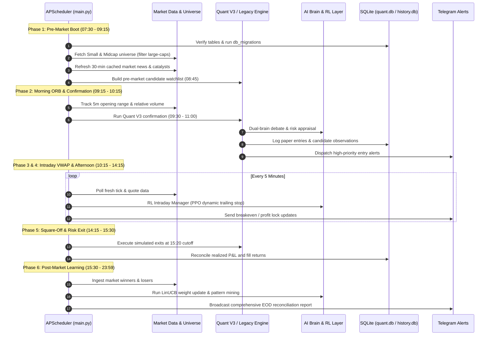

# ⚙️ MarketMind Pro — Backend Architecture Specification

This document provides an exhaustive technical analysis of the MarketMind Pro backend services, orchestration layers, algorithmic screening engines, data persistence, and external broker/AI integrations.

---

## 1. System Orchestration & Operational Lifecycle (`main.py`)

The backend engine is coordinated through [`main.py`](../main.py), which implements an `APScheduler` `BlockingScheduler` pinned to the **Asia/Kolkata** timezone. It operates across 6 distinct market phases every trading day.



### Chronological Job Schedule Breakdown

| Time (IST) | Scheduled Routine | Script / Function | Core Objective |
| :--- | :--- | :--- | :--- |
| **07:30** | Pre-market bot start | `PREMARKET_BOT_START_TIME` | Verify environment, clean stale locks, initialize database. |
| **07:45** | System Health Check | `job_health_check` | Validate connectivity to Yahoo, NSE, Telegram, and DB. |
| **07:50 - 08:20** | Universe Ingestion | `MORNING_UNIVERSE_SCAN_START` | Load 2,489 symbols, apply `LARGECAP_EXCLUDE_LIST`. |
| **08:35** | Price Validation Warmup | `job_price_validation_warmup` | Pre-verify quote latency and spread consistency. |
| **08:45** | Quant Watchlist Creation | `QUANT_WATCHLIST_TIME` | Compute point-in-time features on top 100 liquid candidates. |
| **09:10** | Telegram Delivery Guard | `job_morning_delivery_guard` | Verify morning signals are audited and dispatched. |
| **09:15 - 15:30** | 5-Min Position Tracker | `job_tracking_update` | Check trailing stops, target touches, and price bands. |
| **10:00 - 14:00** | Hourly Tracking Status | `job_tracking_status` | Telemetry broadcast of open position unrealized P&L. |
| **15:00** | Pre-Close Watchlist | `job_preclose` | Screen for late-day institutional volume accumulation. |
| **15:20** | Quant Exit Cutoff | `QUANT_EXIT_TIME` | Simulated market-on-close square-off for paper trades. |
| **15:35** | Winner Finder | `job_find_winners` | Scan NSE gainers (>7%) to extract recurring signatures. |
| **15:45** | Pattern Learner | `job_pattern_learning` | Update Bayesian pattern hit-rates and anti-patterns. |
| **15:50** | After-Market Learning | `job_after_market_learning` | Deep-dive attribution on winning vs losing setups. |
| **16:15** | Automated Data Backup | `run_backup` | Create timestamped snapshots in `data/backups/`. |

---

## 2. The Dual Algorithmic Engine Architecture

MarketMind Pro contains two distinct screening paradigms that coexist in the codebase:

### Paradigm A: Quant V3 Engine (`QUANT_ENABLED=True`, Default)
* **Design Philosophy:** Conservative, verifiable, simulation-first quantitative model. Does not force trades and operates without fabricating missing feeds.
* **Database:** [`data/quant.db`](file:///c:/Users/mishr/Desktop/Intraday%20Stock%20Screener/data/quant.db) (54 MB SQLite containing 5m bars, feature vectors, signal snapshots).
* **Signal Window:** 09:30 to 11:00 IST (never selects stocks in the chaotic opening 15 minutes).
* **Mathematical Filters:**
  * Minimum daily turnover: $\ge \text{₹}20,000,000$ (₹2 Crore).
  * Relative Volume (RVOL): $\ge 1.5\times$ compared to 5 prior sessions at the identical clock time.
  * Structural Risk: Initial ATR-based stop between $0.5\%$ and $3.0\%$.
  * Probability Gate: Regularized logistic model estimating $P(+7\% \text{ gain}) \ge 30\%$ with positive net expectation.
  * Quote Band Headroom: Verifies upper circuit price band allows $+10\%$ headroom before signal emission.
* **Exit Strategy:** Two-tier partial profit taking:
  * $50\%$ position exited at $+7.0\%$.
  * $50\%$ runner exited at $+10.0\%$ (trailing stop locked at $+3.5\%$).
  * Any remainder squared off unconditionally at 15:20 IST.

### Paradigm B: Legacy V2 Multiprocessing Engine (`modules/universe_scanner.py`)
* **Design Philosophy:** Aggressive pre-market momentum scanning for high-beta Small & Midcaps.
* **Execution:** 16 parallel workers partitioning ~2,000 NSE symbols into ~125-stock batches.
* **Exclusion Filter:** [`config.LARGECAP_EXCLUDE_LIST`](../config.py#L204) strictly strips out 80+ large-caps (Reliance, TCS, HDFC Bank, Infosys, etc.) to isolate explosive intraday momentum.
* **Return Targets:** 3-period intraday targeting (+5.0% to +8.0%) backed by 1.5 $\times$ ATR stops (maximum bounded loss: 2.0%).

---

## 3. Intelligence & AI Brain Layer

MarketMind Pro integrates multiple LLMs to perform automated sanity checking, news synthesis, and debate before trade dispatch:

```
                  ┌────────────────────────────────────────┐
                  │ 20 Morning Algorithmic Candidates       │
                  └──────────────────┬─────────────────────┘
                                     │
                 ┌───────────────────┴───────────────────┐
                 │                                       │
                 ▼                                       ▼
     ┌───────────────────────┐               ┌───────────────────────┐
     │   Brain 1: Primary    │               │  Brain 2: Challenger  │
     │  Groq / DeepSeek-R1   │               │ OpenRouter / Gemma-4  │
     └───────────┬───────────┘               └───────────┬───────────┘
                 │                                       │
                 └───────────────────┬───────────────────┘
                                     │
                                     ▼
                    ┌─────────────────────────────────┐
                    │     Dual-Brain Debate Engine    │
                    │   (modules/dual_brain.py)       │
                    │  Requires Consensus Agreement   │
                    └────────────────┬────────────────┘
                                     │
                                     ▼
                    ┌─────────────────────────────────┐
                    │ Locked Final 3 High-Conviction  │
                    │ Picks Dispatched to Telegram    │
                    └─────────────────────────────────┘
```

1. **Primary Reviewer (`modules/grok_brain.py`):**
   * Connects via Groq Cloud or DashScope (Qwen-3.7-Max) for high-speed chain-of-thought analysis.
   * Evaluates macro alignment, resistance levels, sector tailwinds, and earnings embargoes.
2. **Challenger Reviewer (`modules/dual_brain.py`):**
   * Uses OpenRouter (`google/gemma-4-26b-a4b-it:free` or `google/gemma-4-31b-it:free`).
   * Acts as the adversarial risk auditor: attempts to poke holes in breakout validity, identifying bull traps or low-float manipulation.
3. **Consensus Requirement:** If `DEBATE_REQUIRE_BOTH_AGREE = True`, a candidate is rejected unless both LLMs approve the setup.

---

## 4. Reinforcement Learning & Risk Control

* **Tier 1: Contextual Multi-Armed Bandit (`modules/bandit_selector.py`):**
  * Implements **LinUCB** (Linear Upper Confidence Bound).
  * Feature space (8 dimensions): Gap percentage, RSI, RVOL, ATR%, MACD alignment, composite score, sector momentum, and bias intercept.
  * Dynamically balances exploitation (picking patterns that delivered verified gains) with exploration (testing promising setups in novel market regimes).
* **Tier 2: Intraday PPO Dynamic Trade Manager (`modules/rl_intraday_manager.py`):**
  * Observes active position telemetry every 5 minutes.
  * Emits 5 discrete actions: `HOLD`, `TRAIL_SL_BREAKEVEN` (+1.5% gain), `TIGHTEN_SL` (+2.8% gain), `TAKE_PROFIT_EARLY` (+4.2% gain), or `CUT_LOSS_EARLY`.
* **Daily Circuit Breaker (`modules/circuit_breaker.py`):**
  * Daily Tilt Protection: If 2 consecutive stop losses are hit or portfolio drawdown reaches $-2.0\%$, the bot activates an emergency trading freeze for the rest of the day.

---

## 5. Market Data & Broker Integration Architecture

```mermaid
graph LR
    subgraph Providers
        YF["yfinance<br/>(History & 5m Bars)"]
        NSE["nsepython / Web Scraper<br/>(Live Quotes & Bands)"]
        Dhan["DhanHQ REST API<br/>(Live Level-2 Ticks)"]
        Angel["Angel One SmartAPI<br/>(Fallback Quotes)"]
        News["NewsAPI / TheNewsAPI<br/>(30m Cached Headlines)"]
        Macro["FRED & Finnhub<br/>(Bond Yields, FII/DII)"]
    end

    subgraph InternalProviders["Internal Data Providers (modules/)"]
        DP["dhan_provider.py"]
        AD["angel_data.py"]
        NP["news_provider.py"]
        MP["market_pulse.py"]
        FP["finnhub_provider.py"]
        TP["twelve_data_provider.py"]
    end

    Providers --> InternalProviders
```



* **Data Redundancy:** Free public endpoints (`yfinance`, NSE portal) serve as the primary research backbone, while broker APIs (Dhan, Angel One) provide optional millisecond verification when API credentials are provided.
* **Disk Caching:** All news and catalyst searches use strict disk caching (e.g. `data/news_cache.json` with an 1,800-second TTL) to guarantee zero unnecessary API quota consumption.

---

## 6. Notification Pipeline (`modules/alerts.py`)

* Dispatches structured HTML alerts directly to the user's mobile phone via the **Telegram Bot API**.
* **Entity Protection:** Dynamic stock names, catalyst snippets, and reason strings are sanitized via `html.escape()` prior to formatting into HTML bold/code tags, preventing HTTP 400 Bad Request dispatch failures.
* **Audit Trail:** Every delivery attempt (successful or failed) is permanently logged to [`data/telegram_delivery.jsonl`](file:///c:/Users/mishr/Desktop/Intraday%20Stock%20Screener/data/telegram_delivery.jsonl).
