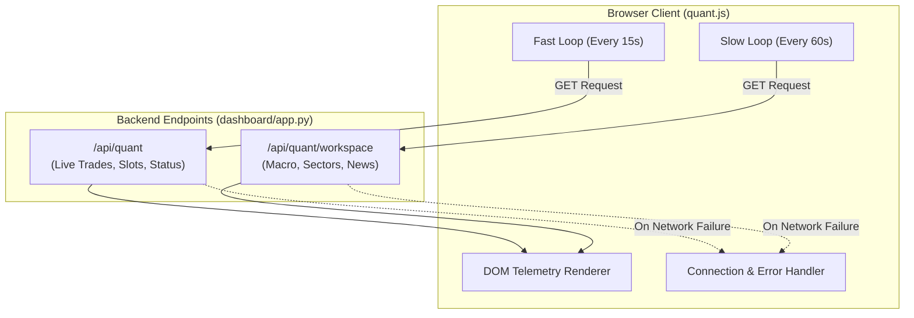

# 🖥️ MarketMind Pro — Frontend Architecture Specification

This document provides a comprehensive analysis of the MarketMind Pro user interface, dashboard web server, REST API contracts, UI components, and client-side lifecycle management.

---

## 1. Web Server & Runtime Environment

The dashboard is built on a **Flask** application wrapped with the **Waitress** WSGI production server, running independently of the bot's scheduler:

* **Entry Point:** [`dashboard/app.py`](../dashboard/app.py)
* **Default URL:** `http://localhost:5001/` (or `http://127.0.0.1:5001/`)
* **Port Rationale:** Port `5001` is chosen to avoid common port collisions with local development servers and Apple AirPlay on port `5000`.
* **Execution Command:**
  ```powershell
  python dashboard/app.py
  # Or via PowerShell launcher:
  .\run_dashboard.ps1
  ```

### Security & Header Protection
1. **Cross-Origin Control Protection (`@app.before_request protect_controls`):**
   * Rejects any `POST` request coming from cross-site origins (`Sec-Fetch-Site: cross-site`) or mismatched origin hosts with an HTTP `403 Forbidden`.
   * Protects the bot control buttons (Start/Stop/Restart) from Cross-Site Request Forgery (CSRF).
2. **Aggressive Cache Invalidation (`@app.after_request _no_cache`):**
   * Automatically attaches `Cache-Control: no-store, no-cache, must-revalidate, max-age=0` to every HTTP response, ensuring that fast-moving intraday prices and trade statuses are never served from browser memory cache.

---

## 2. Dual User Interface Architecture

The frontend serves two distinct interfaces to cater to both quantitative simulation and legacy monitoring:

```
                       ┌─────────────────────────────────────┐
                       │ Waitress WSGI Server (Port 5001)    │
                       └──────────────────┬──────────────────┘
                                          │
                  ┌───────────────────────┴───────────────────────┐
                  ▼                                               ▼
     ┌─────────────────────────┐                     ┌─────────────────────────┐
     │  Quant V3 Workspace     │                     │  Legacy V2 Dashboard    │
     │      Route: `/`         │                     │     Route: `/legacy`    │
     │ Template: quant.html    │                     │  Template: index.html   │
     │   Script: quant.js      │                     │    Script: app.js       │
     └─────────────────────────┘                     └─────────────────────────┘
```

---

## 3. Quant V3 Modern Workspace (`/`)

The primary interface is a reactive single-page dashboard designed for high-density trading telemetry, organized into **7 functional tabs**:

| Tab Name | UI Contents & Telemetry Displayed | Associated API Endpoint |
| :--- | :--- | :--- |
| **1. Overview** | Today's confirmed paper slots (max 3), target progress (+7% / +10%), active models, data coverage meters, and provider health statuses. | `/api/quant` |
| **2. Markets & News** | Live index cards (Nifty 50, Bank Nifty, India VIX), sector momentum heatmaps, top gainers/losers, macro observations, and sourced financial news. | `/api/quant/workspace` |
| **3. Watchlist** | Searchable grid of the 100-stock premarket watchlist, volatility metrics (ATR%), turnover, composite scores, and audit rejection reasons. | `/api/quant/workspace` |
| **4. Position Tracking** | Active paper trades, entry boundaries, structural stops, trailing lock levels, unrealized P&L, and 15:20 square-off timers. | `/api/quant` |
| **5. Performance** | Realized equity curve from resolved paper fills (allocating 1/3 daily capital per slot), maximum drawdown, Sharpe ratio, and historical trade logs. | `/api/quant` |
| **6. Learning & Research** | Model promotion evaluations, Bayesian pattern hit rates, out-of-sample forward evidence, and historical outcome distributions. | `/api/quant/workspace` |
| **7. System Health** | Process PID, scheduler heartbeat, SQLite database sizes, API rate-limit meters, and background thread diagnostics. | `/api/quant` |

### Interactive Stock Inspector Modal
Clicking on any stock ticker anywhere in the workspace dynamically opens the Stock Inspector Modal:
* Fetches detailed 5-minute candle data from `/api/quant/stock/<symbol>`.
* Displays intraday candle charts rendered natively using HTML Canvas / SVG.
* Shows point-in-time features: Relative Volume (RVOL), Average Daily Range (ADR%), Close Location Value (CLV), and historical probability scores.

---

## 4. Complete REST API Specification

The dashboard exposes structured, read-only JSON endpoints for monitoring, alongside protected POST endpoints for process supervision:

### A. Quant V3 Telemetry Endpoints

#### 1. `GET /api/quant`
Returns the core real-time snapshot of Quant V3 operations.
```json
{
  "updated_at": "2026-09-20T09:35:00+05:30",
  "system_status": "ONLINE",
  "active_slots": [
    {
      "slot_id": 1,
      "symbol": "KAYNES",
      "entry_price": 4250.0,
      "stop_price": 4180.0,
      "target_1": 4547.5,
      "target_2": 4675.0,
      "p7_probability": 0.42,
      "status": "FILLED_ACTIVE"
    }
  ],
  "equity_summary": {
    "starting_capital": 100000.0,
    "realized_pnl": 2450.0,
    "drawdown_pct": 0.85
  }
}
```

#### 2. `GET /api/quant/workspace`
Returns broad market context, top sector trends, macro indicators, and verified news.
* Triggers a bounded background market refresh (throttled to at most once per 5 minutes per process).

#### 3. `GET /api/quant/stock/<symbol>`
Returns intraday candle data and recorded pattern frequencies for an individual stock.
* **Parameters:** `symbol` (e.g. `KAYNES` or `TATAELXSI`).
* **Validation:** Sanitizes symbol to uppercase alphanumeric characters; returns HTTP 400 for invalid inputs.

---

### B. Legacy Telemetry Endpoints

* **`GET /api/market_pulse`:** Dynamic indices, sector momentum flows, and top gainers/losers.
* **`GET /api/picks`:** Historical daily picks from `data/history.db`.
* **`GET /api/health`:** Connectivity status across Telegram, SQLite, and network APIs.
* **`GET /api/accuracy`:** Historical win-rate statistics (TP vs. SL hit counts).
* **`GET /api/patterns`:** Top learned chart patterns ordered by success rate.

---

### C. Bot Supervision & Process Controls (Protected POST)

* **`POST /api/bot/start`:** Launches `main.py` in the background via subprocess if not already running.
* **`POST /api/bot/stop`:** Sends graceful termination signal to the active bot PID (reading `data/bot.pid`).
* **`POST /api/bot/restart`:** Re-executes the bot orchestration lifecycle.

---

## 5. Client-Side Lifecycle & State Synchronization

The frontend employs a non-blocking dual-speed polling architecture in [`dashboard/static/quant.js`](../dashboard/static/quant.js):



1. **High-Frequency Loop (15 Seconds):**
   * Polls `/api/quant` to refresh active slot statuses, current prices, stop trails, and bot heartbeats without perceptible latency.
2. **Low-Frequency Loop (60 Seconds):**
   * Polls `/api/quant/workspace` to update sector heatmaps, market indices, news headlines, and macro figures.
3. **Graceful Degradation:** If the backend scheduler is offline or undergoing a reboot, the UI visually highlights the disconnected state without crashing or blanking existing tables.
