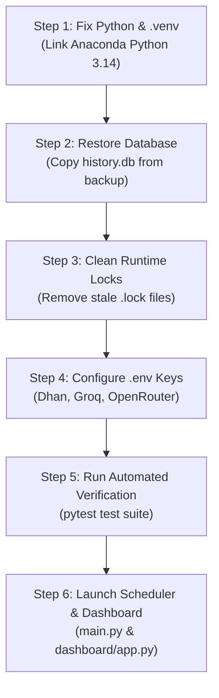

# 🛠️ MarketMind Pro — Missing Components & Actionable Fix Roadmap

This document serves as the official diagnostic registry of all missing dependencies, corrupted configuration paths, uninitialized databases, missing API keys, and architectural divergences in MarketMind Pro, followed by an ordered, step-by-step remediation roadmap.

---

## 1. Complete Catalog of Missing & Broken Components

### A. Environment & Runtime Layer (Critical Blocker)
* **Corrupted Virtual Environment (`.venv`)**:
  * The file [`.venv/pyvenv.cfg`](../.venv/pyvenv.cfg) points to paths from a previous development machine (`C:\Python314\python.exe` and `C:\Users\shubh\OneDrive\Desktop\...`).
  * Running `.\.venv\Scripts\python.exe` crashes immediately with:
    `did not find executable at 'C:\Python314\python.exe': The system cannot find the path specified.`
* **System PATH Missing Python**:
  * Running `python` directly in PowerShell invokes the Windows Store redirector shim.
  * **Installed Binary:** Python 3.14.6 is available on this system at `C:\Users\mishr\anaconda3\python.exe`, but its base conda environment lacks required packages (`feedparser`, `pyotp`, `yfinance`, `newspaper4k`), while `.venv\Lib\site-packages` already has all packages downloaded.

---

### B. Storage & Database Layer (Critical Blocker)
* **Missing Active `data/history.db`**:
  * [`config.py`](../config.py#L114) defines `DB_PATH = "data/history.db"`.
  * Multiple core modules ([`stock_tracker.py`](../modules/stock_tracker.py), [`scanner.py`](../modules/scanner.py), [`pattern_learner.py`](../modules/pattern_learner.py), [`check_db.py`](../check_db.py)) crash or raise SQLite errors when `data/history.db` is missing.
  * **Key Finding:** A 26.8 MB database backup is preserved at:
    [`data/backups/history.db.20260909_031654.bak`](../data/backups)
    The active database was never restored to `data/history.db`.
* **Missing Reinforcement Learning Model Files**:
  * `data/bandit_weights.json` (required by [`modules/bandit_selector.py`](../modules/bandit_selector.py)) does not exist on disk.
  * `data/rl_intraday_policy.json` (required by [`modules/rl_intraday_manager.py`](../modules/rl_intraday_manager.py)) does not exist on disk.
* **Stale Runtime Lock Files**:
  * `data/runtime/marketmind-main.lock` and `data/runtime/marketmind-dashboard.lock` contain stale PIDs from prior runs on another computer (e.g. PID `32516`).

---

### C. Missing External Credentials in [`.env`](../.env)
* **Broker APIs (For Live Feeds & Quotes)**:
  * `DHAN_CLIENT_ID` is empty (although `DHAN_ACCESS_TOKEN` is present, DhanHQ rejects requests without the Client ID).
  * `ZERODHA_API_KEY` and `ZERODHA_ACCESS_TOKEN` are blank.
  * Angel One SmartAPI variables (`ANGEL_API_KEY`, `ANGEL_CLIENT_CODE`, `ANGEL_PIN`, `ANGEL_TOTP_SECRET`) are documented in `.env.example` but omitted from `.env`.
* **AI Intelligence Brains**:
  * `OPENROUTER_GROK_KEY` and `OPENROUTER_GPT_KEY` are empty.
  * `DASHSCOPE_API_KEY` (Qwen Max primary model) is empty.
  * `GROQ_DEEPSEEK_ENABLED` is disabled (`False`).
  * `XAI_API_KEY` contains an OpenRouter key instead of a native xAI key.
* **News & Search Intelligence**:
  * `NEWSAPI_KEY` and `TAVILY_API_KEY` are blank.

---

### D. Testing & Quality Assurance
* **Missing End-to-End Test Modules (`tests/e2e/`)**:
  * In [`PROJECT.md`](../PROJECT.md), Features 13 & 14 outline an opaque-box E2E test suite covering Tiers 1 through 4.
  * The [`tests/e2e/`](../tests/e2e/) folder contains only `__init__.py` and `conftest.py` — zero test scenarios are implemented.
* **Unguarded Root Test Scripts**:
  * Scripts such as `test_accuracy.py`, `test_scanner.py`, and `test_complete_system.py` sit in the root directory rather than `tests/`, and some contain hardcoded large-cap symbols (`INFY`, `TCS`) or live network side-effects.

---

### E. Documentation & Architectural Drift
* **Quant V3 vs. Legacy V2 Discrepancies**:
  * [`README.md`](../README.md) announces **Quant V3** as the default system (`QUANT_ENABLED=True`), targeting setups after 09:30 IST using `data/quant.db`.
  * [`OPERATIONAL_GUIDE.md`](../OPERATIONAL_GUIDE.md) and [`PROJECT.md`](../PROJECT.md) describe the **Legacy V2** engine (08:30 pre-market 16-worker pool scanning 2,489 stocks with Groq DeepSeek debate).
  * [`OPERATIONAL_GUIDE.md`](../OPERATIONAL_GUIDE.md#L38) refers to a database named `screener.db`, which does not exist in the codebase.

---

## 2. Step-by-Step Remediation Roadmap

Follow this sequence to bring MarketMind Pro to 100% operational readiness:



---

### Step 1: Repair the Virtual Environment (`.venv`)

Update [`.venv/pyvenv.cfg`](../.venv/pyvenv.cfg) to point to the local Anaconda Python:
```ini
home = C:\Users\mishr\anaconda3
include-system-site-packages = false
version = 3.14.6
executable = C:\Users\mishr\anaconda3\python.exe
command = C:\Users\mishr\anaconda3\python.exe -m venv c:\Users\mishr\Desktop\Intraday Stock Screener\.venv
```
Verify that the virtual environment executes cleanly:
```powershell
.\.venv\Scripts\python.exe --version
```

---

### Step 2: Restore the Trade Database (`history.db`)

Copy the existing 26.8 MB backup to the active location:
```powershell
Copy-Item "data/backups/history.db.20260909_031654.bak" "data/history.db"
```
Run the database health check script to verify table schemas:
```powershell
.\.venv\Scripts\python.exe check_db.py
```

---

### Step 3: Remove Stale Locks

Purge stale process locks in `data/runtime/`:
```powershell
Remove-Item -Path "data/runtime/*.lock" -Force -ErrorAction SilentlyContinue
```

---

### Step 4: Configure Missing `.env` Credentials

Open [`.env`](../.env) and populate the missing keys:
1. **Dhan Broker:** Set `DHAN_CLIENT_ID` (required for real-time tick feeds).
2. **AI Brain:** Set `OPENROUTER_GROK_KEY` or enable `GROQ_DEEPSEEK_ENABLED=True` with your valid Groq API key.
3. **News Search:** Add `TAVILY_API_KEY` or `NEWSAPI_KEY` if real-time catalyst search is desired.

---

### Step 5: Execute Test Suite

Run the isolated test suite to confirm zero regressions:
```powershell
.\.venv\Scripts\python.exe -m pytest tests --ignore=tests/e2e -q
```

---

### Step 6: Start the Platform

Open two separate terminals and launch the core services:

* **Terminal 1 (Scheduled Bot Engine):**
  ```powershell
  .\.venv\Scripts\python.exe main.py
  ```
* **Terminal 2 (Web Telemetry Dashboard):**
  ```powershell
  .\.venv\Scripts\python.exe dashboard/app.py
  ```

Open your browser to: **`http://localhost:5001`**
