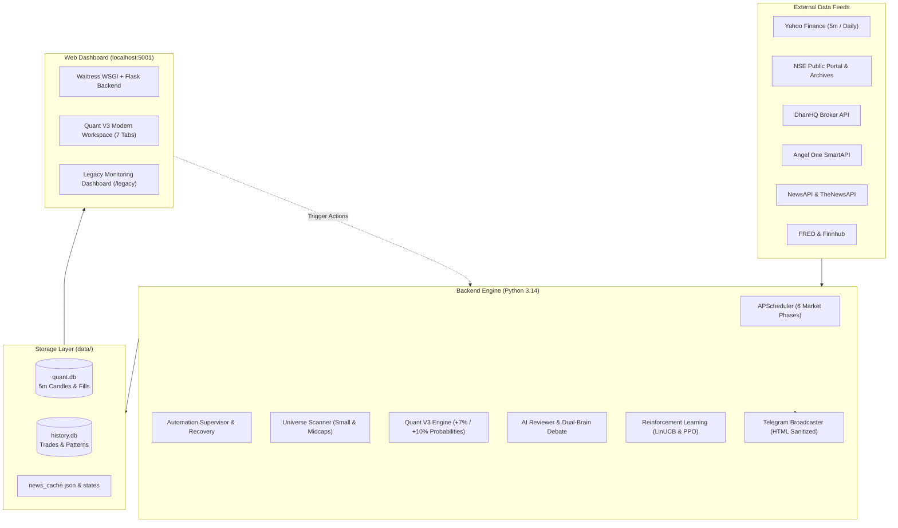

# 📖 MarketMind Pro — System Documentation & Architecture Overview

Welcome to the comprehensive system documentation for **MarketMind Pro** (Intraday Stock Screener & Algorithmic Research Engine for Indian Equities - NSE/BSE).

This directory contains the complete technical breakdown of the entire platform, structured into distinct frontend, backend, and operational audit specifications.

---

## 📂 Documentation Directory

| Document | Description |
| :--- | :--- |
| **[BACKEND_ARCHITECTURE.md](BACKEND_ARCHITECTURE.md)** | Deep-dive into the Python backend: dual engines (Quant V3 vs Legacy V2), scheduler, 16-worker universe scanner, AI debate brain, reinforcement learning (LinUCB & PPO), data persistence (`quant.db` & `history.db`), broker feeds, and Telegram broadcaster. |
| **[FRONTEND_ARCHITECTURE.md](FRONTEND_ARCHITECTURE.md)** | Deep-dive into the user interface: Waitress/Flask WSGI on port 5001, Quant V3 7-tab modern workspace, Legacy V2 monitoring console, stock inspection charts, API telemetry contracts, and control security. |
| **[MISSING_COMPONENTS_AND_ROADMAP.md](MISSING_COMPONENTS_AND_ROADMAP.md)** | Comprehensive audit of all currently missing, broken, or unconfigured components (Python `.venv` path corruption, missing `data/history.db`, empty `.env` API keys, empty `tests/e2e` suite, stale lock files), accompanied by a step-by-step fix roadmap. |

---

## 🏛️ High-Level System Architecture

---

## ⚡ Quick Reference

* **Main Scheduler Process:** `python main.py`
* **Web Dashboard:** `python dashboard/app.py` (accessible at `http://localhost:5001`)
* **Quant Administration CLI:** `python tools/quant.py [status|audit|prepare|learn]`
* **Database Locations:** `data/quant.db` (Quant V3) and `data/history.db` (Legacy & Paper Records)
* **Configuration:** `config.py` and `.env`
